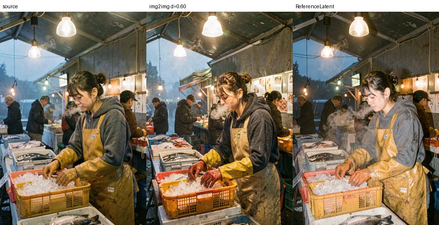
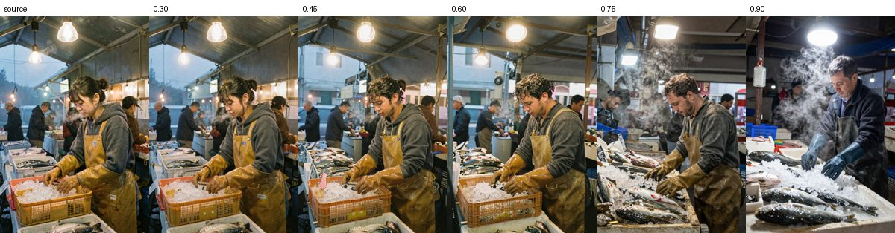
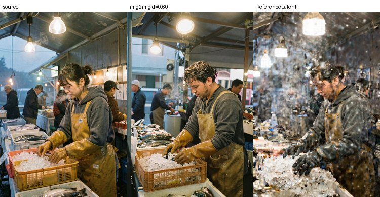

# Image-to-image and reference editing

Companion to `COMFYUI-WEB.md` (using the UI) and `MODEL-COMPARISON.md` (picking a model).
Everything here was executed on this machine on 2026-08-27; timings and failures are measured,
not quoted.

---

## These are two different tools, not two ways to do one thing

| | **img2img** (`VAEEncode` + `denoise` < 1.0) | **reference edit** (`ReferenceLatent`) |
|---|---|---|
| The source image is | the starting point for denoising | conditioning, alongside the prompt |
| Preserves | composition, framing, lighting layout | **subject identity** |
| Changes | the subject, often completely | the scene around the subject |
| Denoise | 0.3-0.9, the main control | 1.0 (full) — the control is the prompt |
| Works on | all three models | **FLUX.2 only** — see warning below |


<sub>Same source, same prompt, klein-9B. Middle: img2img at 0.60 — the market survives, the
fishmonger does not. Right: `ReferenceLatent` — she survives, the scene is re-rendered.</sub>

Reach for **img2img** to restyle a scene or generate variations of a composition. Reach for
**reference edit** to keep a person or object consistent across images.

---

## Quick start

The workflows are saved and appear in the browser's Workflows sidebar:

| Workflow | What it does |
|---|---|
| `z-image-turbo-img2img` | fastest img2img, ~5 s |
| `flux2-klein-9b-img2img` | img2img with klein's texture detail |
| `flux2-dev-img2img` | img2img at the quality ceiling |
| `flux2-klein-9b-edit-reference` | identity-preserving edit |
| `flux2-dev-edit-reference` | identity-preserving edit, slowest |

1. `systemctl --user start comfyui`, open <http://127.0.0.1:8188>
2. Put your source image in `~/AI/ComfyUI/input/` (or drag it onto the `Load Image` node)
3. Open a workflow from the sidebar, select your image, edit the prompt, **Queue**

The saved workflows all point at `i2i_source.png`, a sample left in `input/` for testing.

---

## Denoise — the only knob that really matters


<sub>Z-Image Turbo, one source, identical prompt and seed, denoise 0.30 → 0.90.</sub>

| Denoise | What actually happened |
|---|---|
| **0.30** | near-identical to the source; light cleanup only |
| **0.45** | composition intact, the face begins to drift |
| **0.60** | **the useful default** — scene held, subject re-imagined |
| **0.75** | framing and stall layout start rearranging |
| **0.90** | effectively a new image; only the concept survives |

Iterate on denoise before you touch the prompt. If you want the *scene* kept but the *person*
changed, 0.55-0.65 is the band.

**Steps interact with denoise.** ComfyUI runs `steps × denoise` actual sampling steps, so Z-Image
at 8 steps and denoise 0.30 is only ~2 steps — which is why 0.30 barely changes anything. Raise
steps if you want detail work at low denoise.

---

## Settings per model

Same loader pairings as text-to-image (see `COMFYUI-WEB.md`); only the latent path differs.

| | Z-Image Turbo | FLUX.2-klein-9B | FLUX.2-dev |
|---|---|---|---|
| Diffusion model | `z_image_turbo_nvfp4` | `flux-2-klein-9b-nvfp4` | `flux2-dev-nvfp4` |
| CLIP / type | `qwen_3_4b_fp4_mixed` / `stable_diffusion` | `qwen_3_8b_fp4mixed` / `stable_diffusion` | `mistral_3_small_flux2_fp4_mixed` / `flux2` |
| VAE | `ae.safetensors` | `flux2-vae.safetensors` | `flux2-vae.safetensors` |
| Steps / cfg | 8 / 1.0 | 28 / 1.0 | 28 / 1.0 |
| FluxGuidance | none | 2.0 | 4.0 |
| Reference edit | ❌ corrupts | ✅ | ✅ |

**For img2img the `Empty …Latent` node is gone entirely** — `VAEEncode` supplies the latent, and it
is automatically the right shape for whichever VAE you loaded. The FLUX.2 channel-count trap that
bites text-to-image (`EmptyFlux2LatentImage` vs `EmptySD3LatentImage`) simply cannot occur here.

It still matters for **reference editing**, which needs an empty latent *and* the reference — the
FLUX.2 workflows use `EmptyFlux2LatentImage` for that.

---

## ⚠️ Z-Image Turbo cannot do reference editing

`ReferenceLatent` on Z-Image Turbo **returns `success` and produces a corrupted image** — heavy
speckle across the whole frame. No error, no warning, in the log or the UI.


<sub>Left source, middle a normal img2img, right the same graph with `ReferenceLatent`.</sub>

The node accepts the connection because Z-Image inherits ComfyUI's `Lumina2` base class, which
carries `reference_latents` handling — but the Turbo checkpoint was never trained for image
editing, so the conditioning is noise to it. Use img2img on Z-Image, or klein-9B if you need
identity preservation. (Alibaba ship a separate Z-Image-Edit model; it is not installed here.)

---

## Measured on this machine, 832×1216

| Model | img2img (denoise 0.60) | reference edit |
|---|---:|---:|
| Z-Image Turbo | **5.0 s** warm | — (corrupts) |
| FLUX.2-klein-9B | 33 s † | 49 s |
| FLUX.2-dev | 111 s † | 150 s |

† includes a cold model load; the model was swapped in for that run. Z-Image's 5.0 s is a clean
warm figure averaged over four renders. Reference editing is consistently slower than img2img on
the same model because the reference image adds tokens to attention on every step.

Cold-loading FLUX.2-dev alone costs ~30 s of the figure above — it stages 20 GiB through
`comfy-aimdo` dynamic offload. Doing repeat work on one model is much cheaper than alternating.

---

## Scripting it

Verified API-format graphs — the exact JSON that produced every number in the table above — are
tracked at `configs/comfyui-workflows/`:

```
i2i_zimage.json   i2i_klein.json   i2i_f2dev.json   edit_klein.json   edit_f2dev.json
```

POST one to `/prompt` and poll `/history/<prompt_id>`, as described at the end of
`COMFYUI-WEB.md`. These are the artifacts to trust: the sidebar workflows were generated from
them and round-trip back to them exactly, but the API graphs are what actually ran.
