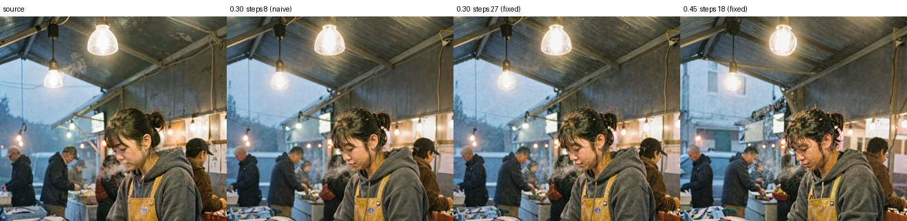

# Image-to-image and reference editing

Companion to `COMFYUI-WEB.md` (using the UI) and `MODEL-COMPARISON.md` (picking a model).
Everything here was executed on this machine on 2026-08-27; timings and failures are measured,
not quoted.

---

## These are two different tools, not two ways to do one thing

| | **img2img** (`VAEEncode` + `denoise` < 1.0) | **reference edit** (`ReferenceLatent`) |
|---|---|---|
| The source image is | the starting point for denoising | conditioning, alongside the prompt |
| Preserves | composition, framing, lighting layout | **subject identity** |
| Changes | the subject, often completely | the scene around the subject |
| Denoise | 0.3-0.9, the main control | 1.0 (full) — the control is the prompt |
| Works on | all three models | **FLUX.2 only** — see warning below |


<sub>Same source, same prompt, klein-9B. Middle: img2img at 0.60 — the market survives, the
fishmonger does not. Right: `ReferenceLatent` — she survives, the scene is re-rendered.</sub>

Reach for **img2img** to restyle a scene or generate variations of a composition. Reach for
**reference edit** to keep a person or object consistent across images.

---

## Quick start

The workflows are saved and appear in the browser's Workflows sidebar:

| Workflow | What it does |
|---|---|
| `z-image-turbo-img2img` | fastest img2img, ~5 s |
| `flux2-klein-9b-img2img` | img2img with klein's texture detail |
| `flux2-dev-img2img` | img2img at the quality ceiling |
| `flux2-klein-9b-edit-reference` | identity-preserving edit |
| `flux2-dev-edit-reference` | identity-preserving edit, slowest |

1. `systemctl --user start comfyui`, open <http://127.0.0.1:8188>
2. Put your source image in `~/AI/ComfyUI/input/` (or drag it onto the `Load Image` node)
3. Open a workflow from the sidebar, select your image, edit the prompt, **Queue**

The saved workflows all point at `i2i_source.png`, a sample left in `input/` for testing.

---

## Denoise, and the step-count trap that goes with it

**Read this before using img2img on Z-Image Turbo.** ComfyUI runs `steps × denoise` *actual*
sampling steps. Leaving steps at the model's text-to-image default silently starves every render
below denoise 1.0 — on Turbo, at 8 steps, denoise 0.30 is **~2 real steps**.

Scale steps so the effective count stays at the model's native value:

```
steps = native_steps / denoise
```

| Denoise | Z-Image (native 8) | klein-9B / FLUX.2-dev (native 28) |
|---:|---:|---:|
| 0.30 | 27 | 93 |
| 0.45 | 18 | 62 |
| 0.60 | **13** | **47** |
| 0.75 | 11 | 37 |
| 0.90 | 9 | 31 |


<sub>Z-Image Turbo, same source/prompt/seed. **Top row** leaves steps at 8. **Bottom row** scales
steps per the table. The gap is widest on the left, where the naive row is doing almost no work.</sub>

### What this actually buys you


<sub>At denoise 0.30, 8 steps is a near-no-op. At 27 steps the same woman is preserved — face,
hair, apron — while the render is genuinely refined: sharper detail, cleaner light, added steam.</sub>

Low-denoise img2img on Turbo goes from useless to useful. With steps scaled:

| Denoise | What it does |
|---|---|
| **0.30-0.45** | **refine and enhance, subject preserved** — the band that was broken before |
| **0.60** | the useful default: scene held, subject re-imagined |
| **0.75** | framing and layout start rearranging |
| **0.90** | effectively a new image; only the concept survives |

The saved Z-Image workflow ships at denoise 0.60 / **13 steps**. If you change denoise, change
steps too — that is the whole trick.

Iterate on denoise before you touch the prompt. If you want the *scene* kept but the *person*
changed, 0.55-0.65 is the band; for the same person rendered better, 0.30-0.45.

---

## Settings per model

Same loader pairings as text-to-image (see `COMFYUI-WEB.md`); only the latent path differs.

| | Z-Image Turbo | FLUX.2-klein-9B | FLUX.2-dev |
|---|---|---|---|
| Diffusion model | `z_image_turbo_nvfp4` | `flux-2-klein-9b-nvfp4` | `flux2-dev-nvfp4` |
| CLIP / type | `qwen_3_4b_fp4_mixed` / `stable_diffusion` | `qwen_3_8b_fp4mixed` / `stable_diffusion` | `mistral_3_small_flux2_fp4_mixed` / `flux2` |
| VAE | `ae.safetensors` | `flux2-vae.safetensors` | `flux2-vae.safetensors` |
| Steps (native, at denoise 1.0) | 8 | 28 | 28 |
| Steps at denoise 0.60 | **13** | **47** | **47** |
| cfg | 1.0 | 1.0 | 1.0 |
| FluxGuidance | none | 2.0 | 4.0 |
| Reference edit | ❌ corrupts | ✅ | ✅ |

**For img2img the `Empty …Latent` node is gone entirely** — `VAEEncode` supplies the latent, and it
is automatically the right shape for whichever VAE you loaded. The FLUX.2 channel-count trap that
bites text-to-image (`EmptyFlux2LatentImage` vs `EmptySD3LatentImage`) simply cannot occur here.

It still matters for **reference editing**, which needs an empty latent *and* the reference — the
FLUX.2 workflows use `EmptyFlux2LatentImage` for that.

---

## ⚠️ Z-Image Turbo cannot do reference editing

`ReferenceLatent` on Z-Image Turbo **returns `success` and produces a corrupted image** — heavy
speckle across the whole frame. No error, no warning, in the log or the UI.


<sub>Left source, middle a normal img2img, right the same graph with `ReferenceLatent`.</sub>

The node accepts the connection because Z-Image inherits ComfyUI's `Lumina2` base class, which
carries `reference_latents` handling — but the Turbo checkpoint was never trained for image
editing, so the conditioning is noise to it.

**Switching to Z-Image Base does not fix this.** Tongyi-MAI have published exactly two Z-Image
checkpoints — `Z-Image-Turbo` and `Z-Image` (base). Neither is an editing model, and there is no
official Z-Image-Edit release. (The "z-image-edit" name online belongs to a third-party website,
not a checkpoint.)

For identity-preserving edits on this machine, use **klein-9B**. For refining an image while
keeping the subject, use Z-Image img2img at denoise 0.30-0.45 with steps scaled — see above.

---

## Is Z-Image Base worth swapping in for img2img?

Short answer: **no, not for this.** Keep Turbo.

The case *for* base is real but narrow. Base is non-distilled, so it runs real CFG (3.0-5.0)
instead of Turbo's fixed 1.0. That means the **negative prompt actually does something** — on
Turbo at cfg 1.0 it is inert, and the negative box in every workflow here is decorative. Base also
takes 28-50 steps, giving finer control when steering a render with the prompt.

The case against:

| | Z-Image Turbo | Z-Image Base |
|---|---|---|
| Download | already installed | **~19 GiB** (BF16; no official quant) |
| Render, 832×1216 | **5-8 s** | ~30-60 s (28-50 steps + real CFG doubles the passes) |
| Negative prompt | inert | works |
| Reference editing | no | **also no** |

Two things settle it. First, the step-compensation fix above recovers the capability that was
actually missing — identity-preserving refinement at low denoise — without spending anything.
Second, base does **not** unlock reference editing, which was the only genuine gap.

There is also a disk argument: 44 GiB free, and LoRA training wants 15-31 GiB of BF16 weights
(`LORA-TRAINING.md`). Base and a training checkpoint do not both fit comfortably.

Get base if you specifically need working negative prompts or stronger prompt steering during
img2img. Otherwise the 19 GiB buys very little that Turbo plus correct step counts does not
already do.

---

## Measured on this machine, 832×1216

| Model | img2img (denoise 0.60) | reference edit |
|---|---:|---:|
| Z-Image Turbo | **8.0 s** (13 steps) | — (corrupts) |
| FLUX.2-klein-9B | 33 s † | 49 s |
| FLUX.2-dev | 111 s † | 150 s |

Z-Image step-compensated timings: 24.2 s at denoise 0.30 (27 steps), 11.0 s at 0.45 (18),
8.0 s at 0.60 (13), 7.0 s at 0.75 (11), 6.0 s at 0.90 (9). The naive fixed-8-step renders were
~5 s but, as shown above, were doing proportionally less work.

† includes a cold model load; the model was swapped in for that run. Z-Image's 5.0 s is a clean
warm figure averaged over four renders. Reference editing is consistently slower than img2img on
the same model because the reference image adds tokens to attention on every step.

Cold-loading FLUX.2-dev alone costs ~30 s of the figure above — it stages 20 GiB through
`comfy-aimdo` dynamic offload. Doing repeat work on one model is much cheaper than alternating.

---

## Scripting it

Verified API-format graphs — the exact JSON that produced every number in the table above — are
tracked at `configs/comfyui-workflows/`:

```
i2i_zimage.json   i2i_klein.json   i2i_f2dev.json   edit_klein.json   edit_f2dev.json
```

POST one to `/prompt` and poll `/history/<prompt_id>`, as described at the end of
`COMFYUI-WEB.md`. These are the artifacts to trust: the sidebar workflows were generated from
them and round-trip back to them exactly, but the API graphs are what actually ran.
