# FLUX Prompting Notes — Photorealistic People

Tested on this machine: FLUX.1-dev **NVFP4**, ComfyUI 0.33.0, RTX 5060 Ti.
Everything below was actually generated and inspected on 2026-08-24, not copied from a guide.

---

## The core principle

**Don't ask for realism. Describe a real photographic situation.**

Asking for "a photorealistic portrait" pushes FLUX toward the glossiest region of its training
data — retouched stock and editorial photography. That is precisely the plastic, too-smooth,
too-symmetrical look people mean when they say an image "looks AI".

Real photographs are mostly *bad* photographs: ugly light, awkward angles, cluttered rooms,
someone blinking. Describe **that**, and realism comes for free.

---

## Words to avoid

These actively hurt. Every one of them is a pull toward polished commercial imagery:

`photorealistic` · `hyperrealistic` · `8k` · `ultra detailed` · `masterpiece` · `editorial
photography` · `professional` · `beautiful` · `stunning` · `flawless` · `perfect skin` ·
`studio lighting` · `neutral background`

> Ironically, **none of the four prompts below contains the word "photorealistic"**, and all four
> are more convincing than the earlier attempt that did.

## Words that work

| Lever | Why it works | Examples |
|---|---|---|
| **Direct flash** | The single strongest cue. Real snapshots have harsh, ugly light. | `direct on-camera flash`, `harsh flash falloff`, `slightly overexposed forehead` |
| **Named skin flaws** | Overrides the retouched-skin default | `uneven skin tone`, `visible pores`, `a small blemish on her chin`, `under-eye shadows`, `chapped lips`, `cold-flushed cheeks` |
| **Cluttered real places** | "Neutral background" is a studio tell | `cluttered kitchen counter with bottles`, `shelf of toiletries`, `city street out of focus` |
| **Not looking at camera** | Eye contact + centred framing reads as posed | `looking away from the lens`, `looking out of frame`, `mid-laugh` |
| **Bad/cheap cameras** | Poor optics look real; perfect optics look rendered | `2000s digital compact camera`, `heavy phone camera sharpening`, `chromatic aberration`, `low dynamic range` |
| **Named film stock** | Buys grain and scan colour (see caveat below) | `35mm film on Kodak Portra 400`, `scanned negative`, `dust specks` |
| **Imperfect framing** | Real photos are badly composed | `cropped slightly off-centre`, `imperfect framing`, `natural unposed framing` |
| **Weather / environment** | Forces physically real light behaviour | `flat grey overcast light`, `wind blowing hair across her face` |

---

## Settings that worked

| Parameter | Value | Note |
|---|---|---|
| Resolution | **832 x 1216** | Portrait framing. Both dims **must be divisible by 16** for FLUX latents. |
| Steps | **35** | 25 is fine for objects; faces need more. Beyond ~40 gives little. |
| **FluxGuidance** | **2.0** | The most important dial. 3.5+ goes waxy and over-contrasted. **Lower = more photographic.** |
| KSampler `cfg` | **1.0** | Always 1.0 for FLUX — real guidance is the FluxGuidance node. |
| Sampler / scheduler | `euler` / `simple` | Reliable default |
| Negative prompt | *empty* | FLUX dev ignores it; cfg 1.0 means it does nothing anyway |

Cost on this machine: **28–32 s** per image at these settings.

---

## The four tested recipes

All four used the same seed (`4242`) so differences are prompt-driven, not luck.

### A — Flash snapshot ✅ BEST


<sub>tracked copy: `docs/samples/A_flash.jpg` · full-res original: `ComfyUI/output/A_flash_00001_.png` (not in git — ComfyUI/ is ignored)</sub>

```
candid snapshot at a house party, direct on-camera flash, harsh flash falloff into a dark
background, slightly overexposed forehead and nose, a woman mid-laugh looking away from the
lens, uneven skin tone, visible pores, a small blemish on her chin, flyaway hair strands,
cluttered kitchen counter with bottles behind her, amateur photo taken on a 2000s digital
compact camera, slight chromatic aberration, imperfect framing
```

**Result:** the most convincing by a clear margin. Blown highlights on forehead and nose, shiny
skin, hard falloff to black, awkward downward angle, genuine background clutter. Reads as a photo
someone actually took rather than one a model posed for. **This is the recipe to start from.**

### C — Documentary / environmental ✅ strong
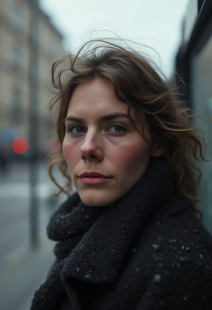

<sub>tracked copy: `docs/samples/C_documentary.jpg` · full-res original: `ComfyUI/output/C_documentary_00001_.png` (not in git — ComfyUI/ is ignored)</sub>

```
documentary photograph of a woman waiting at a bus stop in winter, flat grey overcast light,
wind blowing strands of hair across her face, worn wool coat, cold-flushed cheeks and nose tip,
chapped lips, city street out of focus behind her, shot on 35mm at f/2, natural unposed framing,
she is not looking at the camera
```

**Result:** very good. Cold-flush and windblown hair are convincing, street bokeh is real.
Slightly let down by glassy eyes and a face that is a touch too symmetric.

### B — Film stock ⚠️ beautiful, wrong target
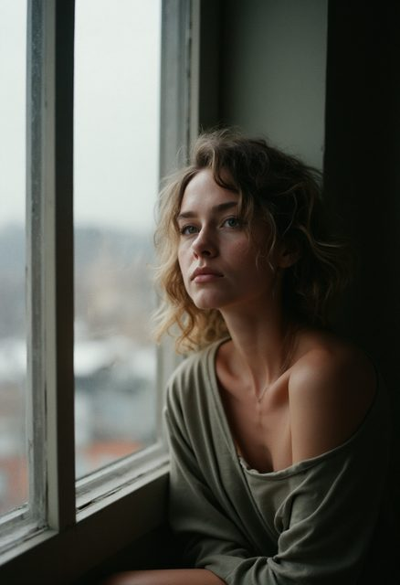

<sub>tracked copy: `docs/samples/B_film.jpg` · full-res original: `ComfyUI/output/B_film_00001_.png` (not in git — ComfyUI/ is ignored)</sub>

```
35mm film photograph on Kodak Portra 400, a woman sitting by a window in a cluttered apartment,
flat overcast daylight, unretouched skin with visible texture, faint under-eye shadows, no makeup,
fine film grain, she is looking out of frame, cropped slightly off-centre, muted desaturated
colour, scanned negative, dust specks
```

**Result:** gorgeous grain and scan colour, but it reads as a *styled editorial shoot with a
professional model*, not a candid photo of an ordinary person. **Naming a film stock buys texture,
not candour.** Use it for mood, not for "is this a real person".

### D — Phone mirror selfie ❌ instructive failure
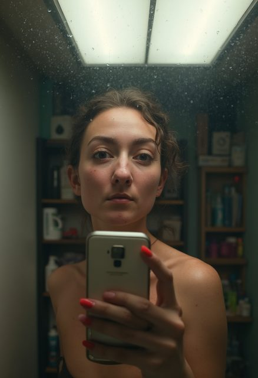

<sub>tracked copy: `docs/samples/D_phone.jpg` · full-res original: `ComfyUI/output/D_phone_00001_.png` (not in git — ComfyUI/ is ignored)</sub>

```
casual mirror selfie on an older smartphone, bathroom mirror with water spots and fingerprints,
harsh overhead fluorescent light casting shadows under the eyes and nose, holding the phone up,
slight motion blur, uneven skin, no makeup, tired expression, cluttered shelf of toiletries
behind her, low dynamic range, heavy phone camera sharpening, slightly blown highlights
```

**Result:** the *environment* is excellent — fluorescent panel, water spots, cluttered shelf, dead
tired expression. But the **hand is broken**: impossible finger positions, mangled nails, and the
mirror geometry is wrong (the phone *is* the camera, so it cannot be photographed face-on).
It also invented bare shoulders that were never requested.

---

## Known failure modes on this setup

**Hands.** FLUX's classic weakness, and **4-bit NVFP4 makes fine articulated structure worse** —
4-bit quantization costs the most exactly where detail is finest. Practical rule: **keep hands out
of frame** unless you are prepared to inpaint them. Avoid prompts that require holding objects.

**Eyes at off-angle poses.** Subtly asymmetric, or the far eye sits wrong. More likely in ¾ views
than straight-on. Re-roll the seed; it is seed-dependent, not prompt-dependent.

**Mirror / reflection geometry.** FLUX does not reason about optics. Mirror selfies, reflections
in windows and photos-of-screens come out physically impossible.

**Prompt drift on long prompts.** Late clauses get weaker. Put the important things first.

**NVFP4 quality ceiling.** This is a 4-bit checkpoint chosen for speed. For a quality reference,
an fp8 FLUX checkpoint (~16 GiB) would be sharper on faces and hands. Not downloaded — the speed
is the whole reason for the NVFP4 path. See `README.md` for the trade-off.

---

## Reusable template

```
<candid/snapshot framing>, <harsh or ugly light source>, <overexposure or falloff artifact>,
a <subject> <doing something, not looking at the lens>, <2-3 named skin imperfections>,
<flyaway hair / clothing detail>, <cluttered specific environment>, <cheap camera and its artifacts>,
imperfect framing
```

Then: **guidance 2.0, 35 steps, 832x1216, cfg 1.0, euler/simple.**

Iterate on the **seed** first — faces are highly seed-sensitive. Only change the prompt once several
seeds all show the same problem.


---

## Z-Image Turbo — same prompts, different settings

The recipes above transfer directly. Only the sampler settings change:

| Parameter | FLUX.1-dev | Z-Image Turbo |
|---|---|---|
| Steps | 35 | **8** |
| Guidance | FluxGuidance node @ 2.0 | *no FluxGuidance node* |
| KSampler `cfg` | 1.0 always | **1.0** (1.5 costs 2x for little gain) |
| Sampler | euler / simple | euler / simple |

**`cfg` above 1.0 doubles render time** — classifier-free guidance runs a conditional *and* an
unconditional pass. Measured: cfg 1.0 = 4.99 s, cfg 1.5 = 9.35 s, same 8 steps.

Running the `A_flash` prompt unchanged through Z-Image:

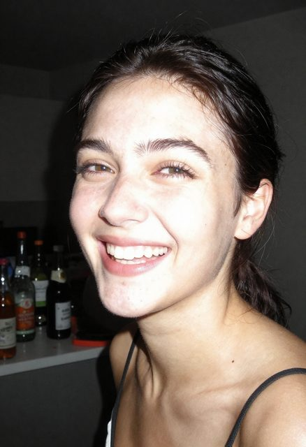

<sub>cfg 1.0, 8 steps, 4.99 s — `docs/samples/z_image_cfg10.jpg`</sub>

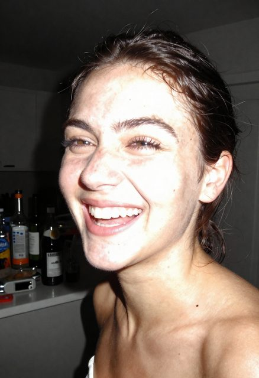

<sub>cfg 1.5, 8 steps, 9.35 s — more blown-out flash, arguably more realistic, but twice the cost</sub>

Both are more convincing than the FLUX version of the same prompt: harder flash shadow on the wall,
better skin micro-texture, plausible label detail on the bottles. **For photoreal people, Z-Image is
now the default on this machine**; reach for FLUX when you need its LoRA ecosystem.

---

## Batch test — diverse scenes and ethnicities, 2026-08-24

Seven portraits, all Z-Image Turbo NVFP4, 832x1216, 8 steps, cfg 1.0, euler/simple. Each ~6 s warm.
Different scene, different ethnicity, different named imperfections per the lever table above.

### Fixing the flash portrait's skin-tone mismatch

The original flash recipe (`A_flash`, `z_8step_cfg10/15` above) blew the face out near-white while
the neck and chest stayed a visibly different, tanner shade — a real flash artifact taken too far,
reading as an inconsistency rather than a photographic effect. Two changes fixed it:

- softened `"slightly overexposed forehead and nose"` to a milder, unstated falloff
- **added an explicit instruction**: `"even consistent skin tone across her face, neck and chest
  with no colour mismatch"`


<sub>fixed flash recipe, Black woman, house party — face/neck/chest now read as one skin tone</sub>

**Lesson: name the failure mode directly in the prompt.** "Consistent skin tone" is not a generic
quality word (like "photorealistic") — it is a specific, falsifiable instruction the model can act
on, so it survives the recipe's realism-over-polish philosophy.

### The set

| Scene | Ethnicity | Verdict |
|---|---|---|
| 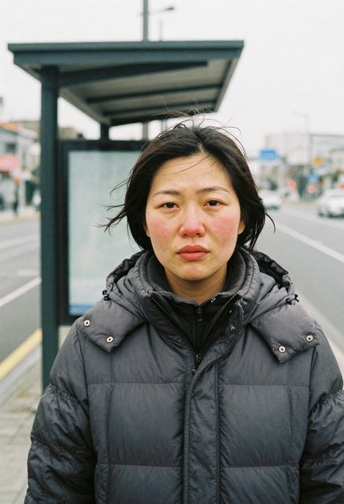 | East Asian, bus stop, winter | **Best of the batch.** Cold-flushed cheeks, real bus shelter, genuine street depth. |
| 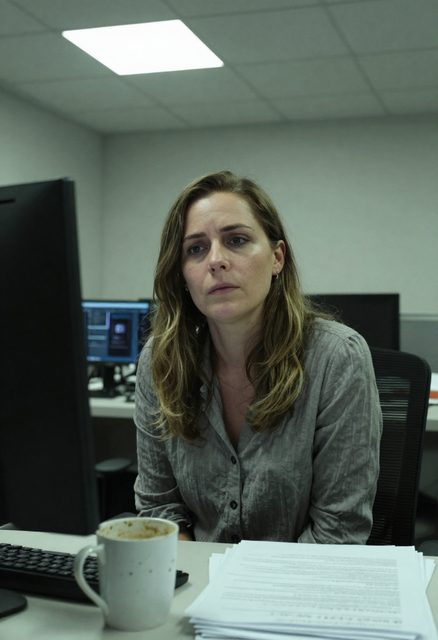 | White European, office desk | Flat fluorescent panel, coffee-stained mug, blurred monitors with plausible on-screen text. Unmistakably a real workplace snapshot. |
| 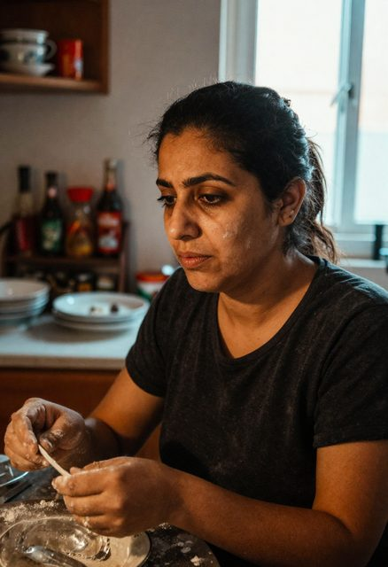 | Middle Eastern, home kitchen | **Hands holding a utensil mid-task, correctly formed.** See correction below. |
| 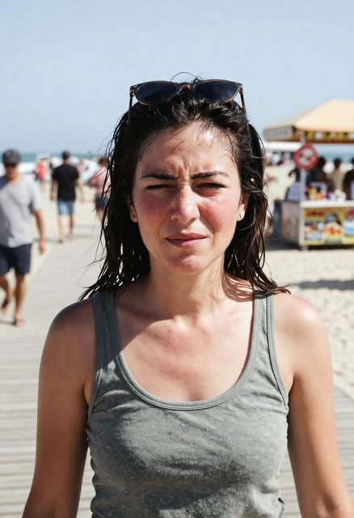 | (requested Latina — see note) | Convincing squint into midday sun, real background crowd, sweat sheen. Ethnicity adherence missed; read as ambiguous/white. |
| 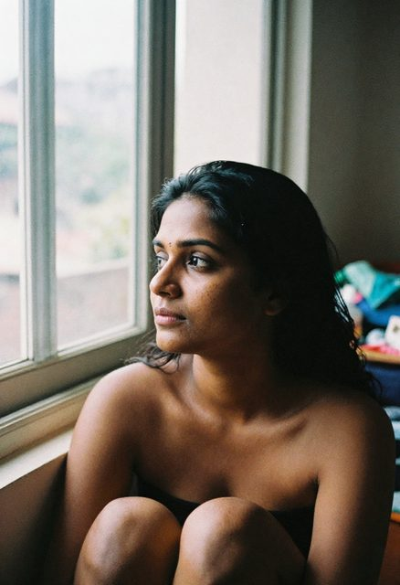 | South Asian, window light | Strong light modeling and grain. Prompt asked for "sitting by a window in a cluttered apartment" and got a more undressed, intimate framing than intended — the model leaned harder into "unretouched/no makeup" than the scene called for. |
| 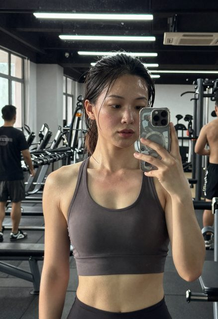 | Southeast Asian, gym mirror | **Correct mirror-selfie optics.** See correction below. |

### Two corrections to the failure modes documented above

**Hands are not a reliable failure on Z-Image the way they are on FLUX.** The kitchen shot has a
hand gripping a dough scraper mid-task — fingers, grip and tool all coherent. Small sample (one
shot), not a guarantee, but 4-bit NVFP4 clearly is not costing Z-Image the same hand quality it
costs FLUX.

**Z-Image got mirror-selfie geometry right where FLUX did not.** `D_phone` (FLUX, above) produced
a physically impossible mirror reflection. The equivalent Z-Image shot — phone held up to a gym
mirror — has correct phone-in-mirror physics and a plausible one-handed grip.

### Two real misses, reported not hidden

**Ethnicity adherence is inconsistent.** The beach shot asked for a Latina woman and produced
someone who reads as ambiguous-to-white. Five of seven scenes hit the requested ethnicity
convincingly; this one didn't. Re-rolling the seed, or naming more specific features (skin tone,
hair texture) rather than a demonym alone, is the likely fix — not yet tested.

**Prompt scope can drift into unintended wardrobe/framing.** The window-light shot asked for a
woman "sitting by a window in a cluttered apartment" and the softer instructions ("unretouched
skin", "no makeup") pulled the result toward a more intimate framing than the scene implied. Be
explicit about wardrobe if it matters ("wearing a t-shirt", "fully clothed") rather than assuming
the scene description constrains it.

---

## Head-to-head — FLUX.1-dev vs Z-Image Turbo, same prompt, five scenes

Same prompt text fed to both models (FLUX at its recipe — 35 steps, FluxGuidance 2.0; Z-Image at
its recipe — 8 steps, cfg 1.0), 832x1216, 2026-08-24. Each prompt included an explicit "consistent
skin tone" clause and explicit wardrobe ("fully clothed", specific garments) to close the two gaps
found in the previous batch.

| Scene | FLUX.1-dev | Z-Image Turbo | Verdict |
|---|---|---|---|
| Subway platform, night |  | 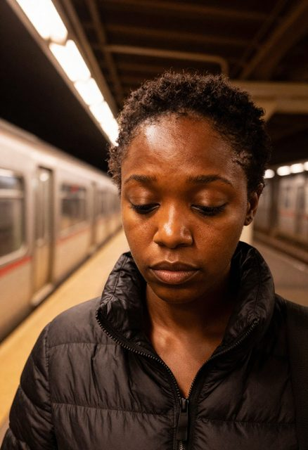 | **Z-Image.** FLUX reads as a styled editorial shot; Z-Image's downward gaze and flatter mood match "candid, tired, not looking at camera." |
| Rain, umbrella, night | 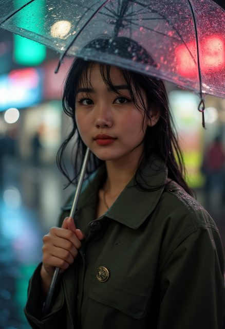 | 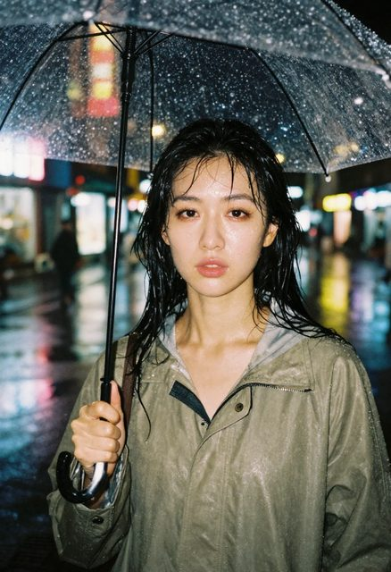 | **Z-Image**, marginally. FLUX is the prettier image (styled, red lipstick) but that's the problem — Z-Image's soaked hair and neutral expression read as an actual person caught in the rain. |
| Grocery aisle |  |  | **Z-Image, clearly.** Prompt said "mid-glance at a product, not posed for the camera." FLUX smiled straight at the lens anyway. Z-Image did exactly what was asked. |
| Laundromat |  | 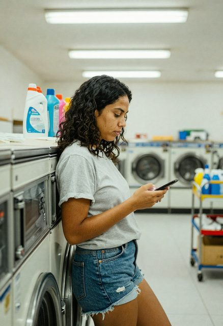 | **Z-Image, clearly.** Same failure: prompt said "looking at her phone, not at the camera." FLUX looked at the camera. Z-Image looked at the phone. |
| Park bench, overcast | 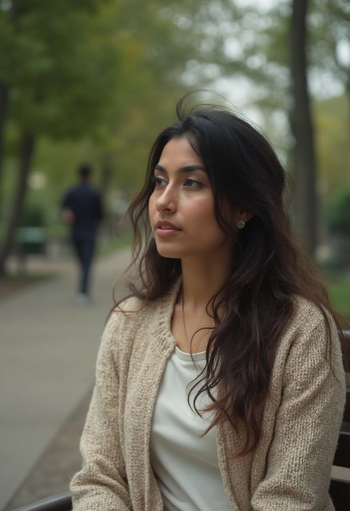 | 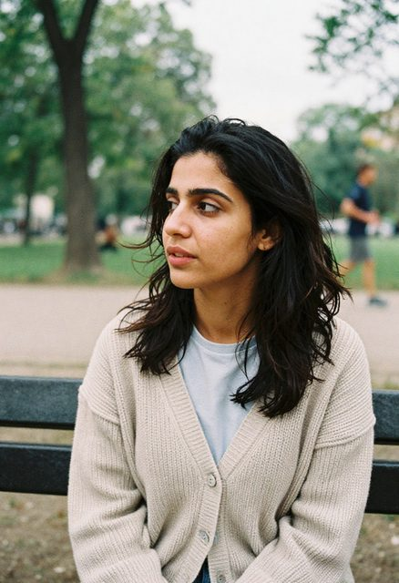 | **Closest pairing of the five.** Both convincing; Z-Image has a slight edge on grain and skin texture, FLUX is a touch glossier. |

### The pattern that emerged

**FLUX has a strong pull back toward "posed, smiling, looking at the camera" even when the prompt
explicitly says otherwise.** It happened in 2 of 5 scenes here (grocery aisle, laundromat) and cost
those images the "candid" quality that was the entire point. Z-Image followed the same instructions
correctly in all five. This isn't about which model draws a better face — it's that **Z-Image is
more prompt-faithful on ordinary scene direction**, which matters more for "real photo" realism than
raw fidelity does.

### Timing, warm

| | Per image | Relative |
|---|---:|---|
| FLUX.1-dev (35 steps) | 27.6-28.2 s | 1x |
| Z-Image Turbo (8 steps) | **5.24-5.25 s** | **~5.3x faster** |

### Where FLUX still wins

Purely on lighting and rendering polish, FLUX's rainy-street and subway shots are the more
*beautiful* images — better colour grading, more cinematic bokeh. If the goal is a styled shot
rather than a convincing candid, FLUX is still the stronger renderer. It only loses when the prompt
explicitly demands the subject not perform for the camera.

**Working conclusion for this machine: default to Z-Image Turbo for candid/photoreal people work.
Reach for FLUX when the brief is closer to editorial/styled than candid.**

---

## Three-way — FLUX.1-dev, Z-Image Turbo, FLUX.2-klein-9B, same five scenes

Same prompts and seeds as the FLUX vs Z-Image comparison above, now with klein-9B added
(guidance 2.0, 28 steps — see the correction below for why guidance 2.0 and not the 4.0 first
tried). 832x1216, 2026-08-24.

**A defect was found and is reported here rather than fixed quietly.** klein-9B's first
verification render (elsewhere in this repo's history) used guidance 4.0 and produced blotchy
red patches across the subject's cheeks that were wrongly described as "convincing windburn" at
the time. They were not — they were a rendering artifact. Dropping guidance to 2.0 (the value
already tuned for FLUX.1) fixed 3 of 5 scenes below, but **grocery_aisle still shows a clear
artifact** and subway_platform is borderline. klein-9B is not yet reliable for skin on this
machine; verify every face render before trusting it.

| Scene | FLUX.1-dev | Z-Image Turbo | FLUX.2-klein-9B |
|---|---|---|---|
| Subway platform |  |  | 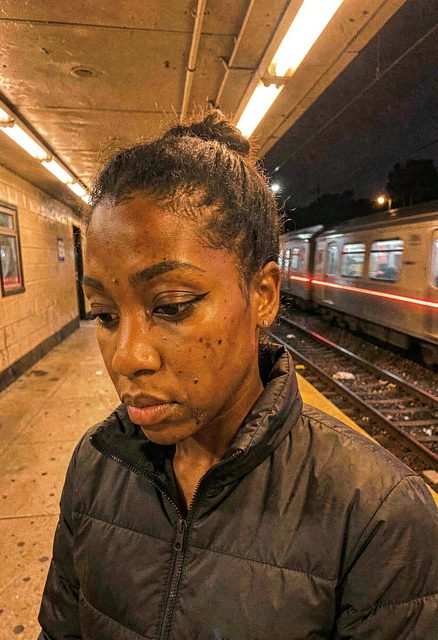 |
| Rainy street |  |  | 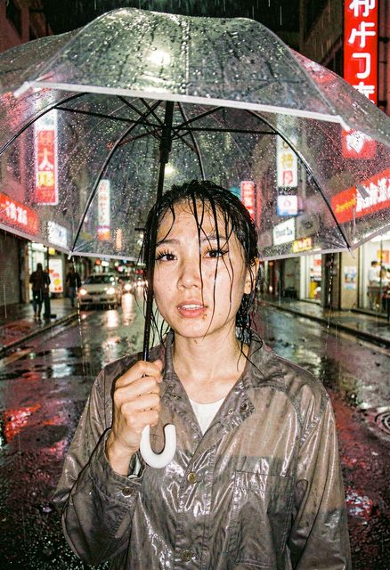 |
| Grocery aisle |  |  |  |
| Laundromat |  |  | 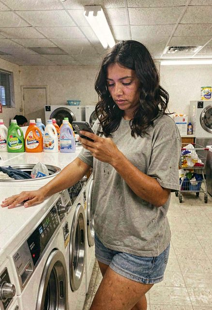 |
| Park bench |  |  | 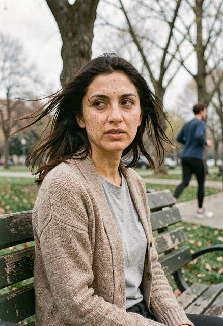 |

### Per-scene notes on klein-9B specifically

- **Subway platform** — borderline. A few dark marks near the mouth/chin could pass as skin
  detail but the pattern looks more like an artifact than intentional. Background (train, tiled
  platform, sodium lighting) is excellent.
- **Rainy street** — clean. No skin defects, correct rain physics on the umbrella and raincoat,
  real neon signage. One of the best renders of the whole three-way set.
- **Grocery aisle** — **defect confirmed.** Dark blotches on her cheek match a stain in the exact
  same position on her hoodie — a texture bleed-through between garment and face, not a rendered
  blemish. Do not use this image; regenerate with a different seed if this scene is needed.
- **Laundromat** — clean, aside from a faint minor mark on one forearm (far less severe than the
  grocery-aisle defect, plausible as a real mark). Correct phone-in-hand pose, real detergent
  bottles and washers.
- **Park bench** — clean. Freckles rendered naturally and match the prompt request, weathered
  wood grain on the bench, real jogger in the background. Best klein render of the set.

### What this means in practice

klein-9B produces the **highest peak texture fidelity of the three models** — when it works. It
also has the **highest failure rate** for skin artifacts, at least at the guidance values tested
so far (4.0 clearly too high; 2.0 better but not clean). FLUX.1 and Z-Image did not show this
failure mode anywhere in the same batch of scenes.

**Recommendation until this is better understood:** use klein-9B for texture-critical work
(clothing, environments, non-human subjects) where its detail advantage matters and there's no
face to break. For people, prefer Z-Image (fast, prompt-faithful, no artifacts observed) or
FLUX.1 (slower, more polished, no artifacts observed), and if you do use klein-9B for a face,
generate at least 2-3 seeds and actually look at each one before picking.

---

## Root cause found: klein-9B's artifact was the "blemishes" prompt language, not guidance

Following the 3-of-5 result above, the same five scenes were regenerated with skin-imperfection
language removed entirely — no "blemishes," "scars," "under-eye shadows," "tired skin." Lighting,
candid framing, wardrobe and environment prompts were kept unchanged; only the explicit skin-flaw
descriptors were dropped. 832x1216, guidance 2.0 (klein/FLUX), cfg 1.0, same seeds.

**Result: 5 of 5 clean on klein-9B — including the exact `grocery_aisle` scene that had the
texture-bleed defect twice before.** The subway platform borderline case also came out clean.

| Scene | FLUX.1-dev | Z-Image Turbo | FLUX.2-klein-9B |
|---|---|---|---|
| Subway platform | 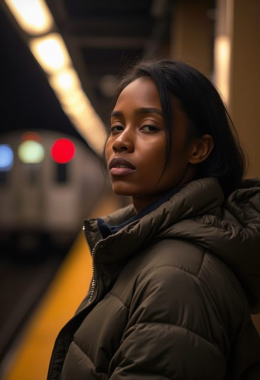 | 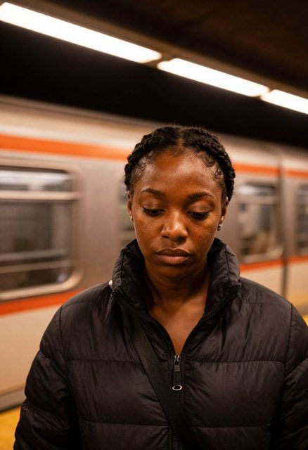 |  |
| Rainy street | 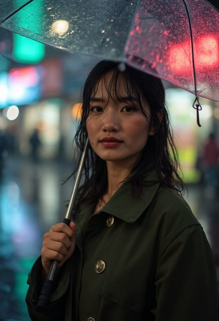 | 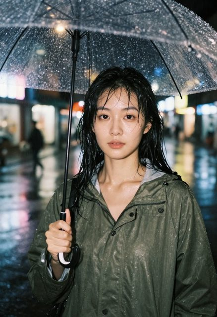 | 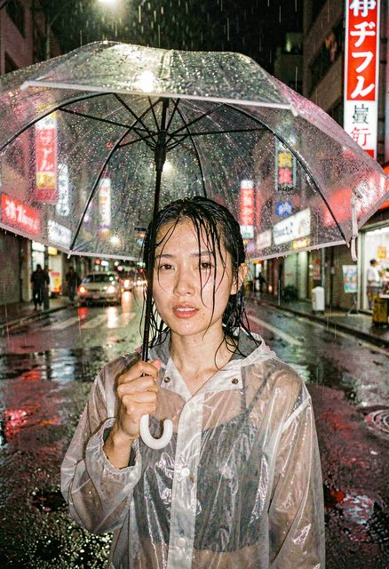 |
| Grocery aisle |  |  |  |
| Laundromat | 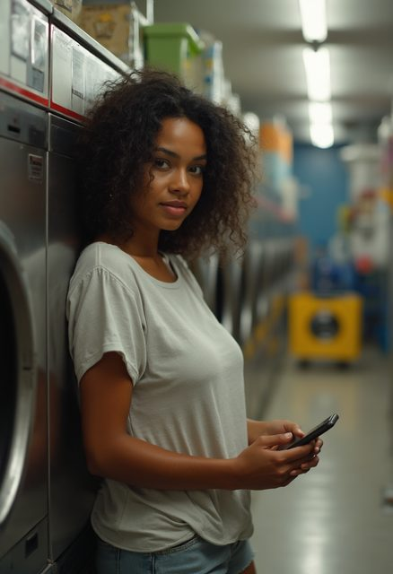 | 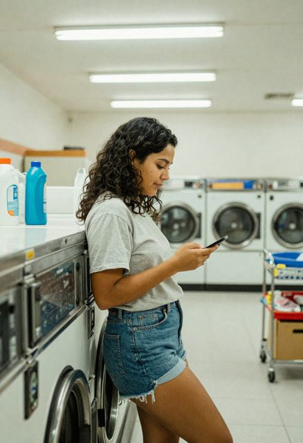 | 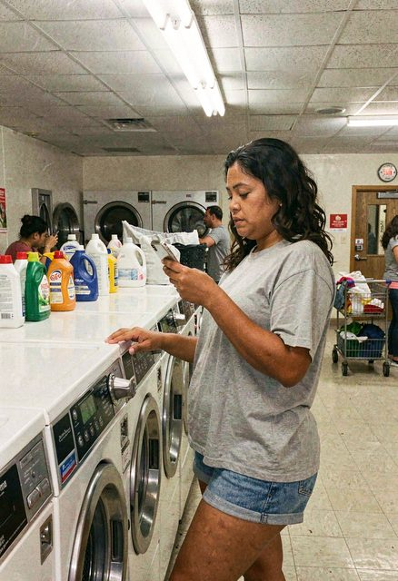 |
| Park bench |  | 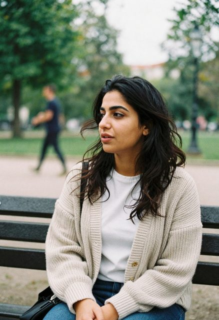 | 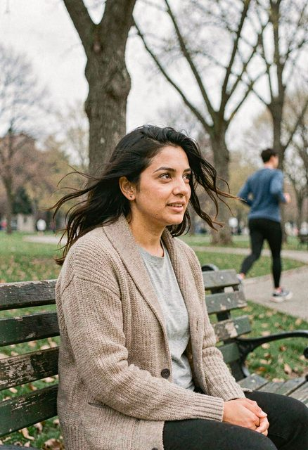 |

**This corrects the previous entry's conclusion.** It was not "klein-9B is unreliable for skin at
any guidance" — it was that the specific phrase `"visible skin texture and a couple of small
blemishes"` (and similar: scars, under-eye shadows) pushed klein's quantized text encoder toward
rendering those flaws as garment-bleeding texture artifacts rather than clean blemishes. Guidance
2.0 vs 4.0 likely made the *severity* worse or better, but the *cause* was the prompt content, not
the sampler setting. FLUX.1 and Z-Image handled the same imperfection language without this
failure, so it appears to be klein/Qwen3-8B-encoder-specific.

**Practical rule going forward:** for klein-9B specifically, keep skin-flaw language minimal or
absent. Realism cues that come from lighting, environment, framing and "not looking at camera" (per
the lever table at the top of this document) are enough on their own and carry none of this risk.
If a scene genuinely needs a visible scar or blemish on a klein-9B render, treat it as a
render-and-inspect case, not a trust-on-first-try one.

### Timing, this batch (warm)

| | Per image |
|---|---:|
| Z-Image Turbo | 4.77-4.81 s |
| FLUX.2-klein-9B | 19.36 s |
| FLUX.1-dev | ~28 s (consistent with earlier measurements) |
