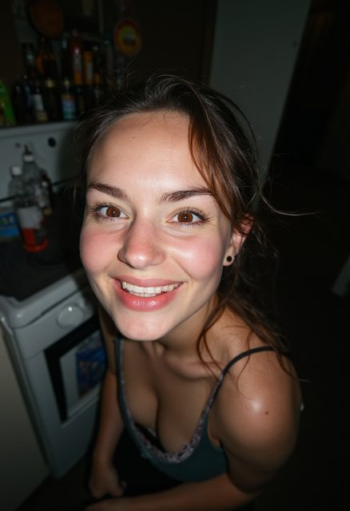
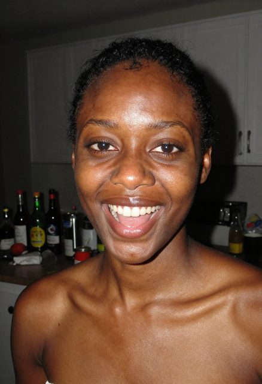
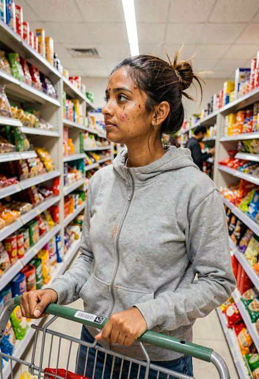
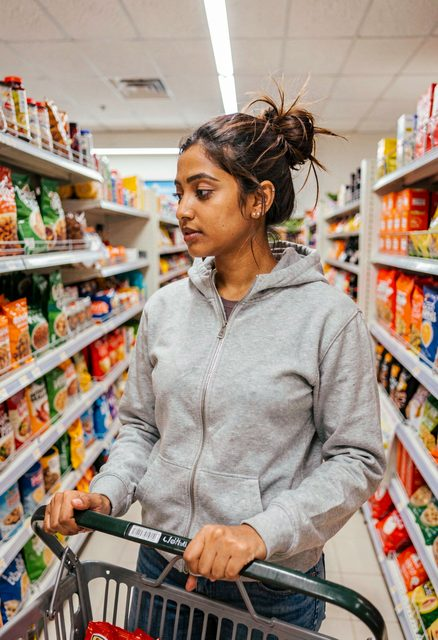
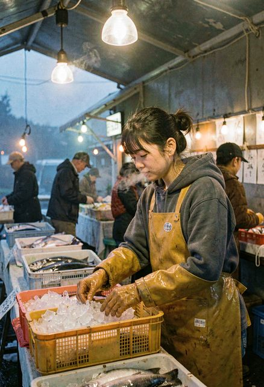

# Prompting Notes — Photorealistic People

Tested on this machine across FLUX.1-dev, Z-Image Turbo and FLUX.2-klein-9B (all NVFP4), roughly
115 generated images inspected individually, 2026-08-24/25. Condensed to current findings — see
git history for the full batch-by-batch record if the reasoning behind any of this is needed.
**Neither FLUX.1-dev nor FLUX.2-klein-9B (removed 2026-08-29) is still installed** — their
findings are kept below where they illustrate something general (e.g. the hands/mirror failures
are FLUX.1-specific, not FLUX.2-family).

---

## The core principle

**Don't ask for realism. Describe a real photographic situation.**

Asking for "a photorealistic portrait" pushes a model toward the glossiest region of its training
data — retouched stock and editorial photography. That is precisely the plastic, too-smooth look
people mean when they say an image "looks AI." Real photographs are mostly *bad* photographs: ugly
light, awkward angles, cluttered rooms, someone blinking. Describe **that**, and realism comes free.

## Words to avoid

`photorealistic` · `hyperrealistic` · `8k` · `ultra detailed` · `masterpiece` · `editorial
photography` · `professional` · `beautiful` · `stunning` · `flawless` · `perfect skin` ·
`studio lighting` · `neutral background` — every one pulls toward polished commercial imagery.
None of the working recipes below use any of them.

## Levers that work

| Lever | Why | Examples |
|---|---|---|
| **Direct flash** | Strongest single cue — real snapshots have harsh, ugly light | `direct on-camera flash`, `harsh flash falloff` |
| **Named skin detail** | Overrides the retouched-skin default | `uneven skin tone`, `visible pores`, `cold-flushed cheeks` |
| **Cluttered real places** | "Neutral background" is a studio tell | `cluttered kitchen counter`, `city street out of focus` |
| **Not looking at camera** | Eye contact + centred framing reads as posed | `looking away from the lens`, `mid-laugh` |
| **Cheap cameras** | Poor optics look real; perfect optics look rendered | `2000s digital compact`, `phone camera oversharpening` |
| **Named film stock** | Buys grain/scan colour, but reads as *styled*, not candid — use for mood only | `35mm film on Kodak Portra 400` |
| **Imperfect framing** | Real photos are badly composed | `cropped slightly off-centre` |
| **Weather / environment** | Forces physically real light behaviour | `flat grey overcast light`, `wind blowing hair` |

**Skin-tone consistency needs its own instruction.** A flash prompt can blow the face out to a
different tone than the neck/chest — a real artifact taken too far. Fix: add
`"even consistent skin tone across her face, neck and chest"` explicitly. This is a specific,
falsifiable instruction, not a vibe word, so it survives the realism-over-polish approach above.

**State wardrobe explicitly if it matters.** Soft cues like "unretouched, no makeup" can drift a
render toward more undressed framing than intended. `"fully clothed"` / `"wearing a t-shirt"`
reliably prevents this.

## Reusable template

```
<candid/snapshot framing>, <harsh or ugly light source>, <overexposure or falloff artifact>,
a <subject> <doing something, not looking at the lens>, <consistent skin tone clause>,
<flyaway hair / clothing detail, explicit wardrobe>, <cluttered specific environment>,
<cheap camera and its artifacts>, imperfect framing
```

Iterate on **seed** first — faces are highly seed-sensitive. Only change the prompt once several
seeds show the same problem.

---

## Settings by model

Neither FLUX.1-dev nor FLUX.2-klein-9B is currently installed; kept for reference.

| Parameter | FLUX.1-dev | Z-Image Turbo | FLUX.2-klein-9B |
|---|---|---|---|
| Steps | 35 | **8** | 28 |
| Guidance (FluxGuidance node) | **2.0** (3.5+ goes waxy) | none | **2.0** (4.0 causes skin artifacts — see below) |
| KSampler cfg | 1.0 always | **1.0** (1.5 doubles render time for little gain) | 1.0 always |
| Sampler/scheduler | euler / simple | euler / simple | euler / simple |
| Resolution | 832×1216 (must be ÷16) | 832×1216 | 832×1216 |
| Warm render time | 28-32 s | **~5-6 s** | 20-22 s |

---

## Model comparison, in brief

Full head-to-head with images: `MODEL-COMPARISON.md`. Summary relevant to prompting specifically:

- **Z-Image is the reliable default.** ~50 renders, zero skin/hand/reflection defects. Hands and
  mirror reflections — both classic FLUX-family failures — are simply not a problem here.
- **klein-9B has a real, partially-understood low-light skin artifact.** Speckled dark noise on
  cheeks/neck, occasionally bleeding garment texture onto the face. Appears **only in dim scenes**,
  not correlated with skin tone (verified: dark-skinned subject in bright sun clean, light-skinned
  subject in a dim pub clean). Removing skin-imperfection language ("blemishes," "scars") from the
  prompt reduces severity substantially but does not eliminate it — treat any klein-9B face render
  in low light as render-and-inspect, generate 2-3 seeds, don't trust the first one.
- **FLUX.1 tends to pose/smile even when told not to.** In head-to-head testing it broke "not
  looking at the camera" instructions in 2 of 5 identical scenes; Z-Image followed the same
  instructions correctly in all 5.

## Known failure modes

**Hands** — a FLUX.1-specific weakness (4-bit NVFP4 costs the most where detail is finest). Keep
hands out of frame on FLUX.1, or expect to inpaint. Z-Image has not shown this failure once.

**Text** — gibberish words on signs/menus/books, on every model tested, but **numbers and
currency symbols render correctly** (`$50`, `795`) even when surrounding words don't. Reproducible
split, no known fix.

**Ethnicity adherence** — inconsistent on all models. A requested Latina subject came out
ambiguous/white on one run; a two-subject prompt returned two of the same ethnicity when one was
specified differently. Naming specific features (skin tone, hair texture) rather than a demonym
alone appears to help; not tested systematically.

**Mirror/reflection geometry** — a FLUX.1-specific failure (physically impossible mirror selfies).
Z-Image and klein-9B both handle this correctly, including multi-mirror scenes.

**NVFP4 quality ceiling** — these are 4-bit checkpoints chosen for speed. FLUX.2-dev (see
`README.md`) is sharper on fine detail but takes ~80s/image vs Z-Image's ~6s — worth it only for a
small number of hero renders, never for iteration.

---

## Reference images

Four FLUX.1 recipes that established the core principle (same seed, prompt-driven differences):


<sub>**Best.** Direct flash, harsh falloff, cluttered kitchen — reads as a real snapshot.</sub>


<sub>Same recipe on Z-Image after the skin-tone-consistency fix — face/neck/chest now one tone.</sub>


<sub>klein-9B's low-light artifact: dark blotches on the cheek matching a stain on her hoodie —
garment-texture bleeding onto the face. Guidance 4.0, before the fix.</sub>


<sub>Same scene, clean — skin-imperfection language removed from the prompt, guidance 2.0.</sub>


<sub>klein-9B at its best: cold dawn light, visible breath, wet rubber-glove specularity — the
highest material fidelity produced on this machine.</sub>

More examples across scenes, ethnicities and lighting conditions are in `docs/samples/`
(`p2_*`, `b3_*`, `cmp_*`, `clean_*`, `pr_*` prefixes) — same recipes and settings as above, no
additional findings beyond what's summarized here.
